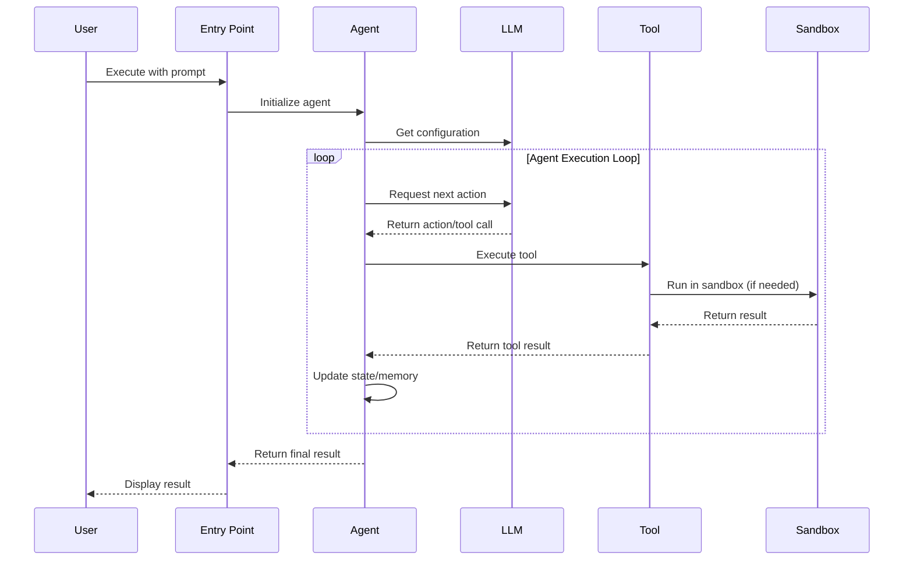

# OpenManus - Architecture Overview

This document provides a comprehensive architectural overview of the OpenManus project using Mermaid diagrams.

## Project Architecture

```mermaid
graph TB
    subgraph "Entry Points"
        MAIN[main.py<br/>Main Agent Entry]
        RUNFLOW[run_flow.py<br/>Flow-based Execution]
        SANDBOX[sandbox_main.py<br/>Sandbox Agent Entry]
        RUNMCP[run_mcp.py<br/>MCP Client]
        MCPSERVER[run_mcp_server.py<br/>MCP Server]
    end

    subgraph "Configuration Layer"
        CONFIG[app/config.py<br/>Configuration Manager]
        CONFIGFILES[config/*.toml<br/>Config Files]
        SCHEMA[app/schema.py<br/>Data Schemas]
    end

    subgraph "LLM Layer"
        LLM[app/llm.py<br/>LLM Interface]
        BEDROCK[app/bedrock.py<br/>AWS Bedrock Support]
    end

    subgraph "Agent Layer"
        BASEAGENT[app/agent/base.py<br/>BaseAgent]
        MANUS[app/agent/manus.py<br/>Manus Agent]
        SANDBOXAGENT[app/agent/sandbox_agent.py<br/>Sandbox Agent]
        SWEAGENT[app/agent/swe.py<br/>SWE Agent]
        BROWSER[app/agent/browser.py<br/>Search Agent]
        SEARCH[app/agent/search.py<br/>Search Agent]
        DATAANALYSIS[app/agent/data_analysis.py<br/>Data Analysis Agent]
        REACT[app/agent/react.py<br/>ReAct Agent]
        TOOLCALL[app/agent/toolcall.py<br/>Tool Call Agent]
        MCPAGENT[app/agent/mcp.py<br/>MCP Agent]
    end

    subgraph "Flow Layer"
        BASEFLOW[app/flow/base.py<br/>BaseFlow]
        PLANNING[app/flow/planning.py<br/>Planning Flow]
        FLOWFACTORY[app/flow/flow_factory.py<br/>Flow Factory]
    end

    subgraph "Prompt Layer"
        MANUSPROMPT[app/prompt/manus.py<br/>Manus Prompts]
        SWEPROMPT[app/prompt/swe.py<br/>SWE Prompts]
        SEARCHPROMPT[app/prompt/search.py<br/>Search Prompts]
        MCPPROMPT[app/prompt/mcp.py<br/>MCP Prompts]
        PLANNINGPROMPT[app/prompt/planning.py<br/>Planning Prompts]
        TOOLCALLPROMPT[app/prompt/toolcall.py<br/>Tool Call Prompts]
        VIZPROMPT[app/prompt/visualization.py<br/>Visualization Prompts]
    end

    subgraph "Tool Layer"
        BASETOOL[app/tool/base.py<br/>BaseTool]
        BASH[app/tool/bash.py<br/>Bash Tool]
        FILEOPS[app/tool/file_operators.py<br/>File Operations]
        PYEXEC[app/tool/python_execute.py<br/>Python Execute]
        WEBSEARCH[app/tool/web_search.py<br/>Web Search]
        COMPUTERUSE[app/tool/computer_use_tool.py<br/>Computer Use Tool]
        CRAWL[app/tool/crawl4ai.py<br/>Crawl4AI]
        ASKHUMAN[app/tool/ask_human.py<br/>Ask Human]
        TERMINATE[app/tool/terminate.py<br/>Terminate]
        STREDIT[app/tool/str_replace_editor.py<br/>String Replace Editor]
        MCPTOOL[app/tool/mcp.py<br/>MCP Tool]
        PLANNINGTOOL[app/tool/planning.py<br/>Planning Tool]
        TOOLCOLLECTION[app/tool/tool_collection.py<br/>Tool Collection]
        CHATCOMPLETION[app/tool/create_chat_completion.py<br/>Chat Completion]
    end

    subgraph "Search Tools"
        SEARCHBASE[app/tool/search/base.py<br/>Search Base]
        GOOGLE[app/tool/search/google_search.py<br/>Google Search]
        BING[app/tool/search/bing_search.py<br/>Bing Search]
        BAIDU[app/tool/search/baidu_search.py<br/>Baidu Search]
        DUCKDUCKGO[app/tool/search/duckduckgo_search.py<br/>DuckDuckGo Search]
    end

    subgraph "Chart Visualization Tools"
        CHARTPREP[app/tool/chart_visualization/chart_prepare.py<br/>Chart Prepare]
        DATAVIZ[app/tool/chart_visualization/data_visualization.py<br/>Data Visualization]
        PYEXECCHART[app/tool/chart_visualization/python_execute.py<br/>Python Execute Chart]
    end

    subgraph "Sandbox Tools"
        SBBROWSER[app/tool/sandbox/sb_browser_tool.py<br/>Sandbox Browser]
        SBFILES[app/tool/sandbox/sb_files_tool.py<br/>Sandbox Files]
        SBSHELL[app/tool/sandbox/sb_shell_tool.py<br/>Sandbox Shell]
        SBVISION[app/tool/sandbox/sb_vision_tool.py<br/>Sandbox Vision]
    end

    subgraph "Sandbox Layer"
        SBCLIENT[app/sandbox/client.py<br/>Sandbox Client]
        SBCORE[app/sandbox/core/sandbox.py<br/>Sandbox Core]
        SBMANAGER[app/sandbox/core/manager.py<br/>Sandbox Manager]
        SBTERMINAL[app/sandbox/core/terminal.py<br/>Terminal]
        SBEXCEPTIONS[app/sandbox/core/exceptions.py<br/>Exceptions]
    end

    subgraph "MCP Layer"
        MCPSERVER2[app/mcp/server.py<br/>MCP Server Implementation]
    end

    subgraph "Daytona Integration"
        DAYTONASB[app/daytona/sandbox.py<br/>Daytona Sandbox]
        DAYTONABASE[app/daytona/tool_base.py<br/>Daytona Tool Base]
    end

    subgraph "Protocol Layer"
        A2AMAIN[protocol/a2a/app/main.py<br/>A2A Main]
        A2AAGENT[protocol/a2a/app/agent.py<br/>A2A Agent]
        A2AEXEC[protocol/a2a/app/agent_executor.py<br/>A2A Executor]
    end

    subgraph "Utilities"
        LOGGER[app/logger.py<br/>Logger]
        UTILS[app/utils/<br/>Utilities]
        FILESUTILS[app/utils/files_utils.py<br/>Files Utilities]
        EXCEPTIONS[app/exceptions.py<br/>Exceptions]
    end

    %% Entry point connections
    MAIN --> MANUS
    RUNFLOW --> FLOWFACTORY
    SANDBOX --> SANDBOXAGENT
    RUNMCP --> MCPAGENT
    MCPSERVER --> MCPSERVER2

    %% Flow connections
    FLOWFACTORY --> BASEFLOW
    FLOWFACTORY --> PLANNING
    RUNFLOW --> MANUS
    RUNFLOW --> DATAANALYSIS
    PLANNING --> BASEFLOW

    %% Agent hierarchy
    BASEAGENT --> MANUS
    BASEAGENT --> SANDBOXAGENT
    BASEAGENT --> SWEAGENT
    BASEAGENT --> BROWSER
    BASEAGENT --> DATAANALYSIS
    BASEAGENT --> REACT
    BASEAGENT --> TOOLCALL
    BASEAGENT --> MCPAGENT

    %% Agents use LLM
    BASEAGENT --> LLM
    LLM --> BEDROCK

    %% Agents use prompts
    MANUS --> MANUSPROMPT
    SWEAGENT --> SWEPROMPT
    BROWSER --> BROWSERPROMPT
    MCPAGENT --> MCPPROMPT
    PLANNING --> PLANNINGPROMPT
    TOOLCALL --> TOOLCALLPROMPT
    DATAANALYSIS --> VIZPROMPT

    %% Agents use tools
    MANUS --> TOOLCOLLECTION
    SWEAGENT --> TOOLCOLLECTION
    BROWSER --> BROWSERUSE
    SANDBOXAGENT --> SBBROWSER
    SANDBOXAGENT --> SBFILES
    SANDBOXAGENT --> SBSHELL
    SANDBOXAGENT --> SBVISION

    %% Tool hierarchy
    TOOLCOLLECTION --> BASH
    TOOLCOLLECTION --> FILEOPS
    TOOLCOLLECTION --> PYEXEC
    TOOLCOLLECTION --> WEBSEARCH
    TOOLCOLLECTION --> BROWSERUSE
    TOOLCOLLECTION --> COMPUTERUSE
    TOOLCOLLECTION --> CRAWL
    TOOLCOLLECTION --> ASKHUMAN
    TOOLCOLLECTION --> TERMINATE
    TOOLCOLLECTION --> STREDIT
    TOOLCOLLECTION --> MCPTOOL
    TOOLCOLLECTION --> PLANNINGTOOL
    TOOLCOLLECTION --> CHATCOMPLETION

    %% Search tools
    WEBSEARCH --> SEARCHBASE
    SEARCHBASE --> GOOGLE
    SEARCHBASE --> BING
    SEARCHBASE --> BAIDU
    SEARCHBASE --> DUCKDUCKGO

    %% Chart visualization
    DATAANALYSIS --> CHARTPREP
    DATAANALYSIS --> DATAVIZ
    DATAANALYSIS --> PYEXECCHART

    %% Sandbox connections
    SANDBOXAGENT --> SBCLIENT
    SBCLIENT --> SBCORE
    SBCORE --> SBMANAGER
    SBCORE --> SBTERMINAL
    SBCORE --> SBEXCEPTIONS

    %% Daytona integration
    SBCORE -.-> DAYTONASB
    DAYTONASB --> DAYTONABASE

    %% Configuration
    CONFIG --> CONFIGFILES
    BASEAGENT --> CONFIG
    LLM --> CONFIG
    CONFIG --> SCHEMA

    %% Utilities
    BASEAGENT --> LOGGER
    BASEAGENT --> UTILS
    UTILS --> FILESUTILS
    BASEAGENT --> EXCEPTIONS

    %% MCP connections
    MCPAGENT --> MCPSERVER2
    MCPTOOL --> MCPSERVER2

    %% Protocol layer
    A2AMAIN --> A2AAGENT
    A2AAGENT --> A2AEXEC

    %% Styling
    classDef entryPoint fill:#e1f5ff,stroke:#01579b,stroke-width:2px
    classDef agent fill:#f3e5f5,stroke:#4a148c,stroke-width:2px
    classDef tool fill:#e8f5e9,stroke:#1b5e20,stroke-width:2px
    classDef config fill:#fff3e0,stroke:#e65100,stroke-width:2px
    classDef flow fill:#fce4ec,stroke:#880e4f,stroke-width:2px
    classDef sandbox fill:#e0f2f1,stroke:#004d40,stroke-width:2px

    class MAIN,RUNFLOW,SANDBOX,RUNMCP,MCPSERVER entryPoint
    class BASEAGENT,MANUS,SANDBOXAGENT,SWEAGENT,BROWSER,DATAANALYSIS,REACT,TOOLCALL,MCPAGENT agent
    class BASETOOL,BASH,FILEOPS,PYEXEC,WEBSEARCH,BROWSERUSE,COMPUTERUSE,CRAWL,ASKHUMAN,TERMINATE,STREDIT,MCPTOOL,PLANNINGTOOL,TOOLCOLLECTION,CHATCOMPLETION tool
    class CONFIG,CONFIGFILES,SCHEMA config
    class BASEFLOW,PLANNING,FLOWFACTORY flow
    class SBCLIENT,SBCORE,SBMANAGER,SBTERMINAL,SBEXCEPTIONS,SBBROWSER,SBFILES,SBSHELL,SBVISION sandbox
```

## Component Layers Description

### 1. Entry Points
- **main.py**: Main entry point for running the Manus agent directly
- **run_flow.py**: Flow-based execution with planning capabilities
- **sandbox_main.py**: Sandbox-based agent execution for isolated environments
- **run_mcp.py**: Model Context Protocol (MCP) client
- **run_mcp_server.py**: MCP server implementation

### 2. Agent Layer
The agent layer implements various AI agents, each specialized for different tasks:
- **BaseAgent**: Abstract base class providing core agent functionality
- **Manus**: Primary general-purpose agent
- **SandboxAgent**: Agent operating in isolated sandbox environments
- **SWE Agent**: Software engineering agent
- **Browser Agent**: Browser automation agent
- **Data Analysis Agent**: Data analysis and visualization agent
- **ReAct Agent**: Reasoning and Acting agent
- **Tool Call Agent**: Specialized agent for tool invocation
- **MCP Agent**: Model Context Protocol agent

### 3. Flow Layer
Manages execution flows and orchestration:
- **BaseFlow**: Abstract base class for execution flows
- **Planning Flow**: Planning-based execution flow
- **Flow Factory**: Factory for creating different flow types

### 4. Tool Layer
Provides various tools that agents can use:
- **File Operations**: File system manipulation
- **Bash**: Shell command execution
- **Python Execute**: Python code execution
- **Web Search**: Web searching capabilities (Google, Bing, Baidu, DuckDuckGo)
- **Browser Use**: Browser automation
- **Computer Use**: Computer interaction tools
- **Chart Visualization**: Data visualization and charting
- **Sandbox Tools**: Tools for sandbox environments

### 5. Sandbox Layer
Provides isolated execution environments:
- **Sandbox Core**: Core sandbox functionality
- **Sandbox Manager**: Manages sandbox instances
- **Terminal**: Terminal emulation
- **Sandbox Client**: Client interface for sandbox operations

### 6. MCP (Model Context Protocol) Layer
Implements the MCP protocol for agent communication:
- **MCP Server**: Server implementation
- **MCP Agent**: Agent using MCP
- **MCP Tool**: Tool integration with MCP

### 7. Configuration Layer
- **config.py**: Configuration management
- **schema.py**: Data schemas and models
- **config/*.toml**: Configuration files for different setups

### 8. Prompt Layer
Manages prompts for different agents:
- Agent-specific prompts (Manus, SWE, Browser, etc.)
- Planning prompts
- Visualization prompts

### 9. Protocol Layer (A2A)
Agent-to-Agent communication protocol implementation

### 10. Utilities
- **Logger**: Logging functionality
- **Files Utilities**: File manipulation utilities
- **Exceptions**: Custom exception classes

## Data Flow

## Key Design Patterns

1. **Agent Pattern**: Each agent extends BaseAgent with specific capabilities
2. **Tool Pattern**: Modular tools that agents can use
3. **Flow Pattern**: Orchestration of multiple agents and steps
4. **Sandbox Pattern**: Isolated execution environments for safety
5. **Factory Pattern**: Flow factory for creating different execution flows
6. **Strategy Pattern**: Different search engines, LLM providers

## Technology Stack

- **Language**: Python 3.12+
- **LLM Integration**: OpenAI, Azure OpenAI, Anthropic, Google, Ollama
- **Sandbox**: Custom sandbox implementation with Daytona integration
- **Web Automation**: Browser-use, Crawl4AI
- **Search**: Google, Bing, Baidu, DuckDuckGo
- **Configuration**: TOML-based configuration
- **Protocol**: MCP (Model Context Protocol), A2A (Agent-to-Agent)
